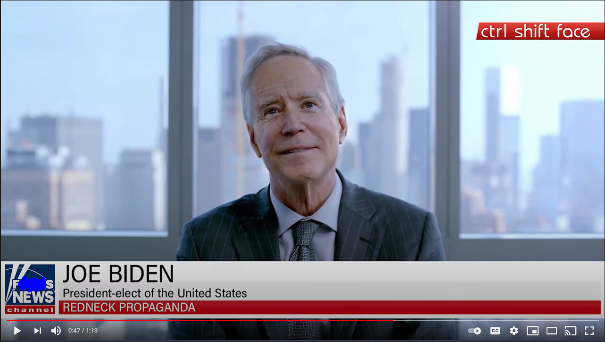
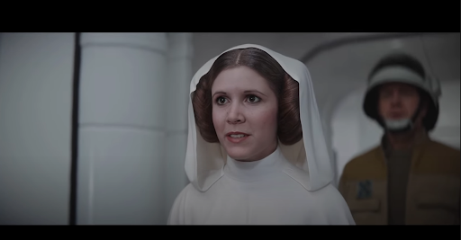
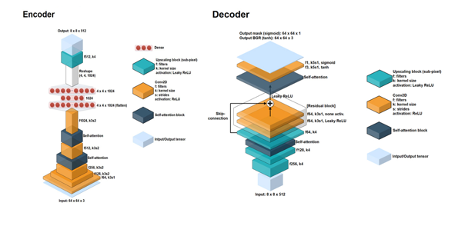
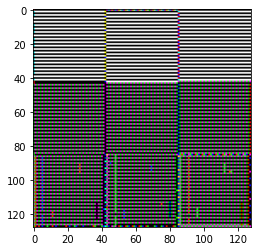

Deepfakes are the most controversial application of deep learning. While they may seem to be everywhere in the media, we investigated what it actually takes to build one. We created a 60 second deepfake video of Jimmy Fallon with John Oliver’s face swapped onto his. We tried a couple different approaches and settled on using an autoencoder. We also generated the dataset ourselves and processed the model outputs into a video using custom scripts. In the end, we were able to partially recreate John Oliver’s face and further research would likely enable us to generate better faces.

Introduction
============

Deepfakes are a very controversial topic in the technology industry right now. Deepfakes are essentially when someone’s face gets replaced with someone else’s in a video, to make it seem like another person is either saying/acting/doing what the original person was doing in the video. This can be extremely helpful, especially in the entertainment industry, where it opens up a world of possibilities for creativity, entertainment, and allowing different techniques to be used for story telling. One example is Princess Leia in the Star Wars movie Rogue One. Princess Leia was originally played by Carrie Fisher, who wasn’t able to play Leia in Rogue One, as Fisher had already aged significantly, but the movie was set in a time period where the character of Princess Leia was very young. A deepfake was made to portray Leia as a young woman, since Fisher was too old for the role. The deepfake was made with old footage of a young Carrie Fisher playing Leia in the 70’s/80’s and was relatively high quality, and was able to get the job done for fans of the franchise, without having to recast the actress and ruin the image of the character and the immersion of the Star Wars world. Carrie Fisher also unfortunately passed, and deepfake technology will allow her memory and image/characterization of Princess Leia to live on forever in the fans’ hearts and also on screen. In the world of deepfaking these benefits also come some problems however, as one may be able to guess. With the ability to make such a realistic video of face masking onto different people, it proves to be a big security challenge in the age of fake news. For example, there could be a video of someone saying very hateful things, or commanding people to do something, and with a deepfake of someone influential put over the video, a lot of people may be more inclined to listen and believe that the deepfake is real and these are genuinely the words of said influential person. Even now, there are many celebrity deepfakes, including ones of Joe Biden, the current president of the United States of America. One can easily spread hateful messages and fake propaganda that can spread very quickly as once the average person sees that the president of the United States is saying something, they are more likely to take it more seriously and actually believe that the message is coming from him.

Especially since deepfakes are getting so realistic nowadays, we wanted to delve into deepfake technology to see how good deepfakes can get, and the inner workings behind them, and also see how good deepfake detection technology is. We were also curious about how much of a security risk they can be, and to see whether the benefits outweigh the issues that come with them. With that, we have attempted to make a deep fake of John Oliver, host of Last Week Tonight on HBO.

Data
====

Our training data consisted of frames containing images of John Oliver. We trained our model on this data after extracting nearly 2000 frames of John Oliver from an existing video. This video was around 22 minutes long at 30 frames per second, and we grabbed every 10th frame. The reason we chose to use this data was that we wanted to use images that had limited background noise, while using just enough samples to produce a decent result with lower training times. The video we obtained of John Oliver contained a clean background, which we deemed would be ideal for our deepfake. The script we used to extract frames from a video used the face recognition library in python. The script and our training data can be found in our Github repository (titled “Face Detection.ipynb”).

This script generates the training samples in a couple simple steps. First, the input video is split into individual frames (specified by the number of frames to skip each during each iteration). Then, each of these frames is run through facial recognition provided by the face recognition library. If there is a face, we make sure that face is John Oliver’s (or any other person) by manually specifying which frame contains him and only him. If there is a match, the portion of the frame inside of the bounding box is saved in a new directory that contains all of the cropped faces. A text file is also created in this directory that marks the frame number and the coordinates and size of the bounding box that the face was cropped from. This step is important for trying to piece together the final video.

We also experimented with larger datasets of John Oliver as the training data. We tried using sets of 4,000, 10,000 and 20,000 images that came from either one or two videos. These larger datasets proved to not improve the quality of the outputs from the model and in some cases even produced worse outputs as the model was quickly overfitting to the training data. Because training times were much longer with the additional data, there was less time available for experimentation and was costly as each experiment had to be run in the Cloud.

Our testing data consisted of frames containing images of Jimmy Fallon. We processed them in an identical manner to the images of John Oliver. The video we obtained of Jimmy Fallon also contained limited background noise and we used our python script to extract approximately 1800 frames. This video is about 1 minute long at 30 frames per second. Because this video is part of the final output, we did not skip any frames here. We used this data to feed into our model during inference, which would output pictures of John Oliver with the facial expressions of Jimmy Fallon.

Related Work
============

Deepfakes have generated a lot of buzz in the deep learning world recently, so there are many research papers out there on this topic. We started with the models and approaches in these papers and expand on them. We initially looked at DeepFaceLab to try and stitch the final video together so the result would appear more seamless than just swapping out pixels for generated images. This tool would have allowed us to blend the faces together and create a softer background so the video is harder to tell apart from a real video. However, we found that using this tool is far more technically advanced than we the time and computation resources for. We also looked at Avatarify for some additional inspiration to see how neural networks can generate (and animate) faces. Although these were resources that we did not use in our final product, they provided valuable insight that assisted us in deciding on our final model design and data pipelines.

1.  DeepFaceLab [1] - Open source software for creating deepfakes
    Link: <https://github.com/iperov/DeepFaceLab>

2.  Avatarify - Open source avatar generator
    Link: <https://github.com/alievk/avatarify-python>

Relevant papers are listed in our references (references 1 and 2)

Our Approach
============

We chose to use an autoencoder because they are known for being able to break down information into chunks and create something with its current knowledge with some sort of input. So, our intuition was that if we train the model to know how to construct the face of someone by feeding it images of that person, we should be able to get the same face as an output by feeding it the face of someone else. When we string these generated images together, we essentially get a deep fake video.

Given the thousands of images used for training, we decided to start very simple in terms of our network and built our first model based on an example we found online that recreated MNIST digits. This model had an encoder-decoder structure that had one hidden layer and an output layer for the encoder and decoder. The results we got for this are below.

We then modified the model to take in 3 channels for color and this is what we got for training (below).

As you can see, the results are still very staticy so we decided in order for us to get better results, we had to use a much more advanced architecture.

After doing some research online, we found a similar approach to our model that utilized convolutions and up-convolutions for autoencoders using a bottleneck architecture. The idea of this was to break down the facial structure of John Oliver to a small amount of features so we could reconstruct him by passing in an image of someone else. The following architecture is what we based our model after.

Source:[https://github.com/shaoanlu/faceswap-GAN](url)

Our implementation does not use the self-attention blocks and also does not utilize the residual block when training the model. Our implementation also takes 128x128x3 images as input and outputs in the same format.

In order to create the final video, we set the model to evaluation mode and fed in all of the Jimmy Fallon (testing data) frames. The outputs were the recreation of John Oliver using Jimmy Fallon’s facial expressions. These outputs are saved to a folder in the current working directory. We used another custom script (titled: “Face Swap.ipynb”) to load in the original frames of Jimmy Fallon (raw test data) and the custom outputs of John Oliver (model generated images). It also loads in the text file (titled: “frame list.txt”) in the raw test data directory that contains the frame number, coordinates, and size of the original face cropped image. This data is used to scale and position the John Oliver faces on top of each frame of the Jimmy Fallon video. Each frame overwrites the existing frame in the test data directory. Once all of the frames have been modified, the script loads all of the newly modified frames into memory and outputs a video file using OpenCV. This output does not contain audio, however this can easily be fixed by using a simple video editor. We were able to extract the audio from the original Jimmy Fallon video and stitch it onto the newly created video to generate the final output.

Experiments and Results
=======================

Using our first model, a simple encoder-decoder, we were able to adapt that model designed for MNIST digits to color. When we fed this model trained on images of John Oliver a test image of Jimmy Fallon, we got the below results.

We then built a much more complex model, a GAN, and spent a long time trying to get it to train properly. We ran in lots of issues where sizes did not match up so debugging this model took a while before we could get it to run all the way through. We did eventually get it to the point where we could run it properly. Though, our output (image below) was statically and not a face. After discussing it with the instructional staff and attempting to debug it we could not find the root cause.

After being unable to fix this, we moved on to work on a model architecture that was similar but the main difference was that it maintained the image shape throughout the model by using padding. This was a success and allowed us to get generated faces. We tried several combinations of hyperparameters before settling on a learning rate of 0.001, 150 epochs, and a batch size of 100. Changing the learning rate would cause the model to diverge and training for too many epochs caused the model to overfit on the training data. We tried increasing the batch size to 202 but then the output images were mostly white with static so we kept 100 as our batch size. We thought we should have increased the batch size since we increased LR but then the output with batch size 202 was horrid.

Our testing data was from a video of Jimmy Fallon. Using all the faces from each frame, our model generates images of John Oliver. First we put all of these frames together into a video. This video can be viewed here: <https://drive.google.com/file/d/1uOVHsR3mCk43_Hl_ZqOBvvHWhJvomrzh/view?usp=sharing> . Then, we stitched these generated images together with the Fallon video using our custom script (titled: “Face Swap.ipynb”). This was the deepfake that we wanted to generate and it can be viewed here: <https://drive.google.com/file/d/1dPhiYUeSjX1bg4bjuEWE_rwMShigJek6/view?usp=sharing>.

Additionally, we tried experimenting with variational autoencoders to see if a different model architecture would produce better results. We trained this model in the same manner that we trained the autoencoder above. However, after trying many different hyperparameters, we were unable to produce a usable result. Below are the model outputs (with Jimmy Fallon as the input) after training over 4,000 training images of John Oliver over 200 epochs.

One reason this might be failing is that the variational autoencoder is trying to learn the underlying distribution of the John Oliver training data, however it was not able to create meaningful latent vectors from images of Jimmy Fallon. This is what likely caused the outputs of the model to be of poor quality.

Conclusion and Discussion
=========================

Some issues that we ran into over the past month of working on this were trying to get google cloud platform to work, misreading the images, and architecture mishaps that provided us odd results. No matter what VM instance we tried to create, we were unfortunately unable to create any to use which made it so we had to rely on our own processing power to train the model. We would have loved to let it train for hours on end however that would require a lot more memory and also time for us to make sure the execution does not time out. The other issue we faced was reading in the images RGB value. We found out that cv2 and pyplot read them very differently so to display them correctly, we had to convert the image data accordingly. Our biggest issue was getting our architecture to work as the github repo had it. The github architecture implemented in using Keras which has some very different functionality that Pytorch just did not have. One of these important features was having an option to automatically keep the image size the same when performing convolutions.

Future Work
===========

If we had two more weeks:

-   We wanted to create a deepfake sophisticated and high quality enough to pass a deepfake detection algorithm. When we tested against a deepfake detection tool, we got pretty low success, and the algorithm was able to tell that it was a deepfake pretty easily.

-   We would have built a discriminator network in addition to our generator to train our model more like how a GAN is supposed to be trained.

Two more months?

-   We would try to implement a large GAN model and train it on hundreds of thousands of images of various talk show hosts. This would allow us to generate images of several talk show hosts and produce various different deepfakes at once. We would also streamline our datapipe such that anyone could select the host they would like to generate and input a video to perform the face swap on. These steps would help us create a deployable version of our project for the general public to use and interact with.

Project Presentation
====================

Link to our project presentation: <https://drive.google.com/file/d/1eSf6QzKD5E_VQOQTL_5icvIR5zBiBaBe/view?usp=sharing>

References
==========

These references include a mixture of scholarly papers and news sources.

Singh, Simranjeet, et al. 2020, Using GANs to Synthesise Minimum Training Data for Deepfake Generation. <https://arxiv.org/pdf/2011.05421.pdf>

[2] Santha, Akhil. 2020, Deepfakes Generation Using LSTM Based Generation Using LSTM Based Generative Adversarial Networks . <https://scholarworks.rit.edu/cgi/viewcontent.cgi?article=11609&context=theses>
